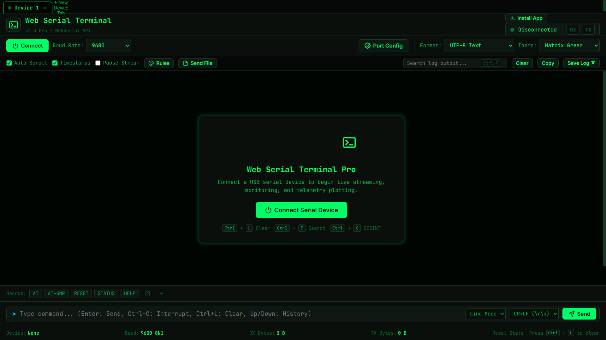

<div align="center">

# Web Serial Terminal Pro (v2.0)

**A high-performance, browser-native Web Serial Terminal, Live Telemetry Plotter, and PWA built with HTML5, CSS3, and Vanilla JavaScript (ES6+).**

Communicates directly with USB-connected microcontrollers, embedded hardware, and serial devices using the modern **Web Serial API**—no backend servers, plugins, or driver installations required.

[](LICENSE)
[](https://developer.mozilla.org/en-US/docs/Web/HTML)
[](https://developer.mozilla.org/en-US/docs/Web/CSS)
[](https://developer.mozilla.org/en-US/docs/Web/JavaScript)
[](https://developer.mozilla.org/en-US/docs/Web/API/Web_Serial_API)
[](manifest.json)
[](#)

<br />



</div>

---

## Table of Contents

- [Overview](#overview)
- [Key Features](#key-features)
- [Performance & Architecture](#performance--architecture)
- [Security & XSS Protection](#security--xss-protection)
- [Supported Hardware & Devices](#supported-hardware--devices)
- [Browser Compatibility](#browser-compatibility)
- [Quick Start & Local Hosting](#quick-start--local-hosting)
  - [Method 1: Python Built-in Server](#method-1-python-built-in-server-recommended)
  - [Method 2: Node.js `npx serve`](#method-2-nodejs-npx-serve)
  - [Method 3: VS Code Live Server](#method-3-vs-code-live-server)
- [Troubleshooting & FAQs](#troubleshooting--faqs)
  - [1. Linux `Permission Denied` on `/dev/ttyUSB0`](#1-linux-permission-denied-on-devttyusb0-or-devttyacm0)
  - [2. Python `http.server` Dual-Stack / IPv6 Wildcard Binding](#2-python-httpserver-dual-stack--ipv6-wildcard-binding)
  - [3. Secure Context Requirement](#3-secure-context-requirement)
- [Keyboard Shortcuts](#keyboard-shortcuts)
- [Project Structure](#project-structure)
- [License](#license)

---

## Overview

**Web Serial Terminal Pro** is designed to replace and upgrade traditional desktop serial applications like **Arduino Serial Monitor**, **PuTTY**, **CoolTerm**, and **Tera Term**.

By utilizing the standard **Web Serial API**, it connects your browser directly to hardware serial devices via USB CDC, CP210x, CH340, FTDI, or PL2303 chips with zero backend dependencies.

---

## Key Features

### 1. Live Telemetry Serial Plotter

- **5th Format Tab**: Real-time line chart plotter for numeric telemetry streams (ADC outputs, sensor readings).
- **Auto-Parsing**: Automatically parses comma/space-separated values and key-value pairs (`ACCEL: 1.2, 4.5`, `temp=24.5`).
- **Multi-Channel**: Renders multiple data series in vibrant neon theme colors with auto-scaling Y-axis grid and dynamic legends at 60 FPS.

### 2. Virtualized Terminal List Output

- **60 FPS Scrolling**: Only visible rows (~30–50 DOM nodes) are rendered regardless of whether log history contains 1,000 or 500,000 lines.
- **Fixed Memory Footprint**: Supports unlimited scrollback with minimal RAM usage.

### 3. Regex Highlighting & Filtering Rules

- **Automated Colorizing**: Custom regex patterns (e.g. `ERROR|FAIL` -> Red, `WARN` -> Yellow, `SUCCESS` -> Green).
- **Persistent Rule Sets**: Saved to `localStorage` and applied dynamically during virtual list rendering.

### 4. Multi-Device Simultaneous Connections (Tabs)

- **Multi-Tab Architecture**: Connect to multiple USB serial ports simultaneously in independent tabs.
- **Concurrent Background Streaming**: Background reading across all connected tabs.

### 5. IndexedDB Session Persistence

- **Refresh Survival**: Automatically persists incoming/outgoing logs into IndexedDB (`WebSerialTerminalDB`).
- **Unattended Logging**: Log history survives page refreshes and browser restarts.

### 6. Multi-Format Log Export

- **Export Formats**: Export logs as plain text (`.txt`), machine-parseable CSV (`.csv`), or Newline-Delimited JSON (`.json` NDJSON).

### 7. Binary File Transfer & Streaming

- **Send File Modal**: Stream binary firmware blobs or text files over serial with configurable packet chunk size and inter-packet delay.
- **Progress Tracking**: Real-time progress bar, byte counters, and cancellation controls.

### 8. Hardware Reset Profiles

- **Board Profiles**: Configurable hardware reset sequences (ESP32/ESP8266 Auto-Reset, ESP32-S3 Native USB, Arduino DTR Pulse, Generic Pulse).

### 9. Persistent Custom Macros & Presets

- **Macro Profiles**: Save custom macros to `localStorage` with built-in presets for ESP32 AT Commands, GPS NMEA, and GRBL CNC.

### 10. PWA Support (Offline Ready)

- **Installable Desktop/Mobile App**: Includes `manifest.json` and service worker (`sw.js`) for standalone window app usage.

---

## Performance & Architecture

- **`requestAnimationFrame` Batching**: Incoming lines at high baud rates (921,600 baud) are buffered and rendered once per 16ms frame, eliminating layout thrashing.
- **Pre-computed Byte Lookup Tables**: O(1) byte array conversions for `HEX`, `ASCII`, and `Binary` modes via pre-allocated 256-element string arrays, bypassing runtime `padStart()` / `toString(16)` overhead.
- **Sequential Write Queue**: All serial write operations run through an `enqueueWrite()` promise chain to prevent Web Serial `writable` stream lock contention.

---

## Security & XSS Protection

- **Safe HTML Entity Escaping**: Incoming raw serial stream data containing HTML tags (e.g. `<script>alert(1)</script>`) is escaped via `escapeHTML()` before search highlighting or rule matching.
- **Safe DOM Text Insertion**: Unhighlighted log text is assigned via `textContent` rather than `innerHTML`, preventing stored-XSS vulnerabilities.

---

## Supported Hardware & Devices

- **Arduino**: Uno, Mega, Nano, Leonardo, Micro, Every, Due
- **Espressif**: ESP32, ESP32-S2, ESP32-S3, ESP32-C3, ESP8266 (NodeMCU, Wemos D1)
- **Raspberry Pi**: Raspberry Pi Pico, Pico W (RP2040)
- **STM32**: Blue Pill, Black Pill, STM32 Nucleo
- **USB-to-Serial Adapters**: CP2102/CP2104, CH340/CH341, FT232RL (FTDI), PL2303

---

## Browser Compatibility

| Browser            | Supported | Notes                                     |
| :----------------- | :-------: | :---------------------------------------- |
| **Google Chrome**  |    Yes    | Chrome 89+ (Desktop & Android)            |
| **Microsoft Edge** |    Yes    | Edge 89+                                  |
| **Opera**          |    Yes    | Opera 75+                                 |
| **Brave**          |    Yes    | Brave Browser                             |
| **Firefox**        |    No     | Web Serial API not implemented by Mozilla |
| **Safari**         |    No     | Web Serial API not implemented by Apple   |

---

## Quick Start & Local Hosting

Since Web Serial requires a **Secure Context** (`https://` or `http://localhost`), host the files locally using any lightweight server:

### Method 1: Python Built-in Server (Recommended)

```bash
# Navigate to project directory
cd web_serial_terminal

# Python 3
python -m http.server 8000 --bind 127.0.0.1
```

_Note: Omitting `--bind 127.0.0.1` can cause Python to bind to the IPv6 wildcard address (`::`), which disables the Web Serial secure-context check in Chromium browsers._

Open **`http://localhost:8000`** in Chrome or Edge.

### Method 2: Node.js `npx serve`

```bash
npx serve -l 8000
```

### Method 3: VS Code Live Server

Right-click `index.html` in VS Code and select **Open with Live Server**.

---

## Troubleshooting & FAQs

### 1. Linux `Permission Denied` on `/dev/ttyUSB0` or `/dev/ttyACM0`

On Linux, add your user to the `dialout` group:

```bash
sudo usermod -a -G dialout $USER
```

_Note: Log out and log back in for group permissions to take effect._

### 2. Python `http.server` Dual-Stack / IPv6 Wildcard Binding

When running `python -m http.server 8000` without explicit binding, Python may output:

```text
Serving HTTP on :: port 8000 (http://[::]:8000/) ...
```

Opening that exact printed link (`http://[::]:8000/`) in Chrome, Edge, or Brave will disable `navigator.serial` because Chromium does not consider raw `[::]` an allowed localhost alias for secure contexts. Fix this by always binding explicitly: `python -m http.server 8000 --bind 127.0.0.1` and navigating to `http://localhost:8000` or `http://127.0.0.1:8000`.

### 3. Secure Context Requirement

Web Serial API is disabled by browsers when accessed via raw IP over HTTP (e.g. `http://192.168.1.50:8000`). Always use `http://localhost:8000`, `http://127.0.0.1:8000`, or serve over HTTPS.

---

## Keyboard Shortcuts

| Shortcut                        | Description                                            |
| :------------------------------ | :----------------------------------------------------- |
| <kbd>Enter</kbd>                | Send command line in buffered Line Mode                |
| <kbd>Ctrl</kbd> + <kbd>L</kbd>  | Clear terminal output & DB log                         |
| <kbd>Ctrl</kbd> + <kbd>F</kbd>  | Focus search input box                                 |
| <kbd>Ctrl</kbd> + <kbd>C</kbd>  | Send `SIGINT` (0x03) interrupt signal / Copy selection |
| <kbd>Ctrl</kbd> + <kbd>D</kbd>  | Send `EOF` (0x04) End-Of-File signal                   |
| <kbd>Up</kbd> / <kbd>Down</kbd> | Navigate command history                               |
| <kbd>Tab</kbd>                  | Send Tab (0x09) byte for device shell completion       |

---

## Project Structure

```
web_serial_terminal/
├── index.html          # Main HTML structure, layout, and modals
├── style.css           # Custom themes, virtualization, and mobile responsive styles
├── script.js           # Core Web Serial API, Virtual List, Telemetry Plotter & DB logic
├── manifest.json       # Web App Manifest for PWA installation
├── sw.js               # Service Worker for offline application caching
├── terminal_preview.png # Application preview screenshot
└── README.md           # Project documentation
```

---
